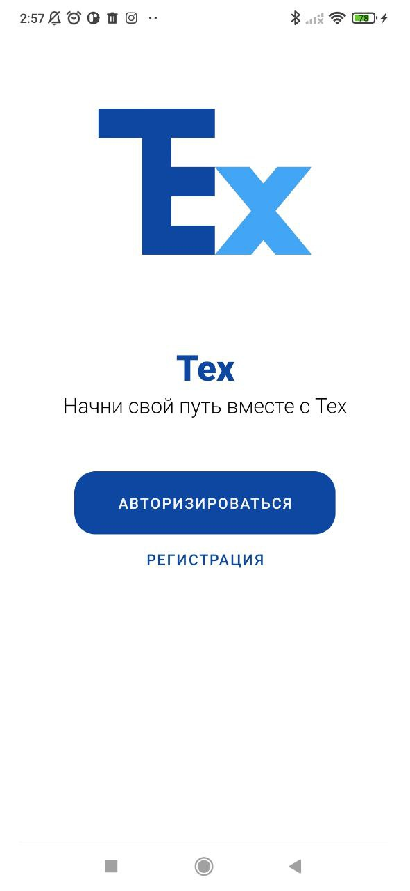
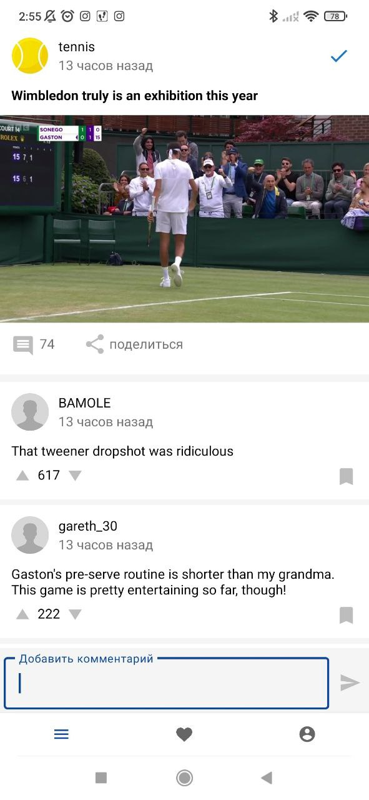

# Приложение основанное на API реддита, создавалось как учебное приложение для получения диплома от Skillbox. 

-Приложение поддерживает 2 языка (английский/русский)

-Архитектура MVVM

-Язык Kotlin

-Поддерживается тёмная тема

-Запросы в сеть происходят с помощью библиотек Retrofit2 и OKHTTP

-Ключ авторизации получается с помощью защищённого протокола OAuth 2.0

Само приложение не большое, со всеми возможностями можно ознакомиться скачав приложение во вкладке Release (Только для Android!)

